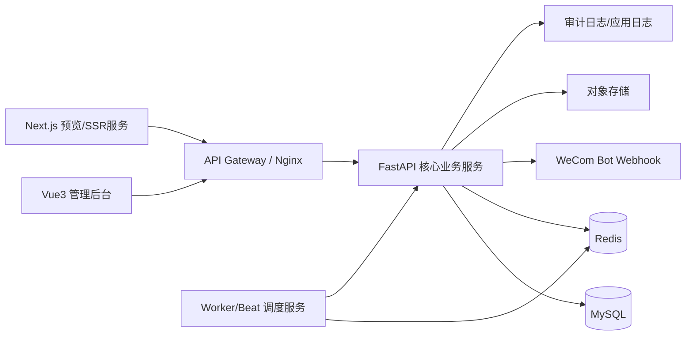
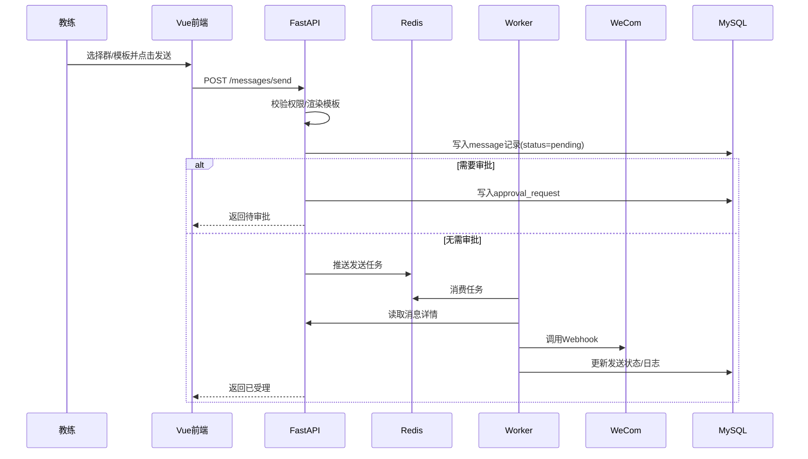
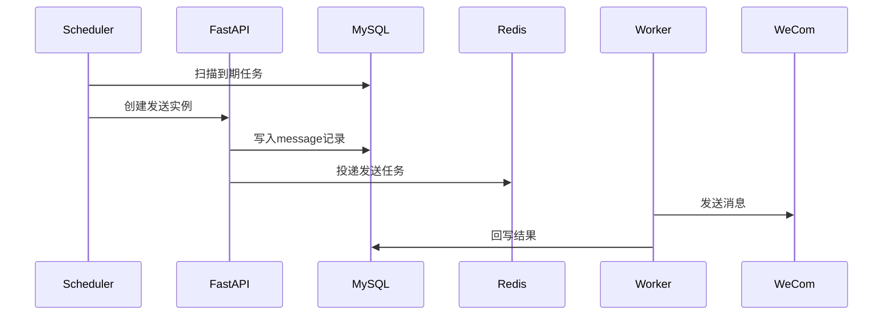

# 企微群消息运营后台系统设计文档

- 项目名称：企微群消息运营后台（WeCom Ops Console）
- 文档版本：v1.0
- 文档状态：可评审
- 编写日期：2026-03-27

---

## 1. 设计目标

本系统面向企业微信群消息运营场景，目标是建设一套支持群管理、模板管理、素材管理、审批、调度、发送、日志与权限管理的可视化平台。系统需兼顾以下要求：

1. 支持非技术人员操作。
2. 支持云端部署与横向扩展。
3. 支持生产级日志、审计、频控、失败重试。
4. 支持多消息类型与未来业务扩展。

---

## 2. 技术栈

## 2.1 前端
- Vue 3
- TypeScript
- Element Plus
- Pinia
- Vue Router
- Axios
- Monaco Editor（用于 JSON 编辑器，可选）

## 2.2 后端
- Python FastAPI：核心业务 API、调度与发送服务
- Next.js：预览页/公开落地页/SSR 扩展层，可承载图文预览、分享页、活动页、未来 BFF 能力
- SQLAlchemy / SQLModel 或 Tortoise（二选一）
- APScheduler / Celery（推荐 Celery + Redis 生产使用）
- Pydantic

## 2.3 存储与中间件
- MySQL：核心业务数据
- Redis：缓存、任务队列、分布式锁、频控计数器
- 对象存储（可选）：图片/文件持久化

---

## 3. 总体架构



### 架构说明

1. **Vue3 管理后台**：提供内部管理页面。
2. **FastAPI 核心业务服务**：提供认证、群管理、模板、素材、任务、审批、发送、日志等 API。
3. **Next.js 服务**：提供可选的 SSR 预览能力，用于图文消息落地页、模板展示页、活动页面等，也可未来承接轻量 BFF 能力。
4. **Redis**：承担缓存、频控、队列、锁与调度协调。
5. **MySQL**：存放结构化业务数据。
6. **Worker/Beat**：消费任务、执行调度、调用发送服务。

---

## 4. 模块设计

## 4.1 认证与权限模块

### 职责
- 登录
- JWT 签发/刷新
- 用户信息查询
- RBAC 权限校验

### 角色模型
- admin：全量权限
- coach：群发送、任务创建、模板复制、查看自身相关记录

### 权限粒度建议
- group:read / group:write
- template:read / template:write
- material:read / material:write
- message:send / message:approve / message:retry
- schedule:read / schedule:write
- dashboard:read

---

## 4.2 群管理模块

### 职责
- 管理群信息
- 维护测试群/正式群
- 维护群标签
- 保存加密 Webhook

### 设计要点
- Webhook 使用应用密钥加密存储。
- 返回前端时只返回 `has_webhook=true/false` 与掩码信息，不返回明文。
- 群停用后，相关任务禁止新建或触发。

---

## 4.3 模板管理模块

### 职责
- 维护系统模板和自定义模板
- 支持模板复制
- 支持变量渲染
- 支持预览

### 设计要点
- 模板内容按消息类型组织。
- 使用 JSON Schema 或内部 DSL 描述变量。
- 渲染引擎统一在后端执行，避免前后端渲染不一致。

---

## 4.4 素材管理模块

### 职责
- 上传和管理图片/文件
- 生成素材引用关系
- 为 image/file/news 提供素材选择器

### 设计要点
- 素材元信息落 MySQL，文件体落对象存储或本地持久卷。
- 记录 MIME、大小、哈希值、引用次数。

---

## 4.5 消息编排与发送模块

### 职责
- 组装消息体
- 参数渲染
- 发送前校验
- 调用企业微信群机器人 Webhook
- 记录结果

### 子模块
- render_service：模板变量渲染
- validator：消息体结构校验
- sender：HTTP 发送封装
- logger：请求响应日志记录
- retry_handler：失败重试

### 设计要点
- 前端只传 `group_id`，后端查询对应 webhook。
- 根据 `msg_type` 生成企业微信机器人所需 payload。
- 对 `raw_json` 与 `template_card` 采用严格 JSON 校验。

---

## 4.6 调度与任务模块

### 职责
- 保存一次性与周期性任务
- 计算下次执行时间
- 到点创建发送作业
- 支持启停、复制、审批后生效

### 调度模式建议

#### 开发/单机模式
- APScheduler 内嵌在 FastAPI 服务中，便于本地快速启动

#### 生产模式
- Celery Beat 负责投递任务
- Celery Worker 负责执行发送
- Redis 作为 Broker

### 设计要点
- Scheduler 与 API 服务逻辑解耦。
- 所有任务执行前再次检查任务状态、审批状态、群状态。
- 支持补偿扫描：服务恢复后补发可容忍时间窗内的漏执行任务。

---

## 4.7 审批流模块

### 职责
- 提交审批
- 审批通过/拒绝
- 审批记录追踪

### 审批触发规则
- 特定正式群必须审批
- 特定消息类型必须审批
- 批量发送必须审批
- 定时任务创建必须审批

### 设计要点
- 审批对象可统一抽象为 `approval_request`。
- 审批通过后触发目标动作：立即发送 / 任务生效。

---

## 4.8 发送记录与审计模块

### 职责
- 保存消息发送全链路数据
- 保存操作审计日志
- 支持重试和筛选

### 日志分类
- audit_log：用户操作日志
- message_log：业务发送日志
- app_log：应用运行日志

---

## 5. 数据流设计

## 5.1 立即发送流程



## 5.2 定时任务触发流程



---

## 6. 数据库设计

> 命名采用蛇形命名；所有表默认带 `id`, `created_at`, `updated_at`, `deleted_at`。

## 6.1 users

| 字段 | 类型 | 说明 |
|---|---|---|
| id | bigint PK | 主键 |
| username | varchar(64) unique | 登录名 |
| password_hash | varchar(255) | 密码哈希 |
| display_name | varchar(64) | 展示名 |
| role | varchar(32) | admin/coach |
| status | tinyint | 1启用 0停用 |
| last_login_at | datetime | 最近登录时间 |

## 6.2 groups

| 字段 | 类型 | 说明 |
|---|---|---|
| id | bigint PK | 主键 |
| name | varchar(128) | 群名称 |
| alias | varchar(128) | 展示别名 |
| group_type | varchar(32) | formal/test |
| tags | json | 群标签 |
| webhook_cipher | text | 加密后的 webhook |
| webhook_mask | varchar(128) | 掩码展示 |
| enabled | tinyint | 是否启用 |
| default_template_set_id | bigint nullable | 默认模板集 |

## 6.3 templates

| 字段 | 类型 | 说明 |
|---|---|---|
| id | bigint PK | 主键 |
| name | varchar(128) | 模板名 |
| category | varchar(64) | 分类 |
| msg_type | varchar(32) | 消息类型 |
| content | longtext | 模板内容 |
| variable_schema | json | 变量定义 |
| default_variables | json | 默认变量 |
| is_system | tinyint | 是否系统模板 |
| owner_id | bigint nullable | 所属人 |
| enabled | tinyint | 是否启用 |

## 6.4 materials

| 字段 | 类型 | 说明 |
|---|---|---|
| id | bigint PK | 主键 |
| name | varchar(128) | 素材名 |
| material_type | varchar(32) | image/file |
| storage_path | varchar(255) | 存储路径 |
| url | varchar(255) | 访问地址 |
| mime_type | varchar(128) | MIME |
| file_size | bigint | 文件大小 |
| file_hash | varchar(64) | 哈希 |
| tags | json | 标签 |
| owner_id | bigint | 上传人 |
| enabled | tinyint | 是否启用 |

## 6.5 schedules

| 字段 | 类型 | 说明 |
|---|---|---|
| id | bigint PK | 主键 |
| name | varchar(128) | 任务名 |
| group_id | bigint | 目标群 |
| template_id | bigint nullable | 模板 |
| msg_type | varchar(32) | 消息类型 |
| content_snapshot | longtext | 任务级内容快照 |
| variables | json | 渲染参数 |
| schedule_type | varchar(32) | once/cron |
| cron_expr | varchar(64) nullable | Cron 表达式 |
| run_at | datetime nullable | 一次性执行时间 |
| timezone | varchar(64) | 时区 |
| skip_weekends | tinyint | 跳过周末 |
| skip_dates | json | 跳过日期 |
| require_approval | tinyint | 是否审批 |
| approval_status | varchar(32) | pending/approved/rejected/not_required |
| enabled | tinyint | 是否启用 |
| next_run_at | datetime nullable | 下次执行时间 |
| owner_id | bigint | 创建人 |

## 6.6 messages

| 字段 | 类型 | 说明 |
|---|---|---|
| id | bigint PK | 主键 |
| source_type | varchar(32) | manual/schedule/retry/test |
| source_id | bigint nullable | 来源任务/审批 |
| group_id | bigint | 目标群 |
| template_id | bigint nullable | 使用模板 |
| msg_type | varchar(32) | 消息类型 |
| rendered_content | longtext | 最终渲染内容 |
| request_payload | json | 请求体快照 |
| status | varchar(32) | pending/sent/failed/cancelled/awaiting_approval |
| scheduled_at | datetime nullable | 计划执行时间 |
| sent_at | datetime nullable | 实际发送时间 |
| retry_count | int | 重试次数 |
| created_by | bigint | 创建人 |

## 6.7 message_logs

| 字段 | 类型 | 说明 |
|---|---|---|
| id | bigint PK | 主键 |
| message_id | bigint | 消息主表 |
| request_payload | json | 本次请求体 |
| response_payload | json | 返回体 |
| http_status | int | HTTP 状态码 |
| success | tinyint | 是否成功 |
| latency_ms | int | 耗时 |
| error_code | varchar(64) nullable | 错误码 |
| error_message | varchar(255) nullable | 错误信息 |
| attempt_no | int | 第几次尝试 |

## 6.8 approval_requests

| 字段 | 类型 | 说明 |
|---|---|---|
| id | bigint PK | 主键 |
| target_type | varchar(32) | message/schedule |
| target_id | bigint | 目标对象ID |
| status | varchar(32) | pending/approved/rejected |
| applicant_id | bigint | 申请人 |
| approver_id | bigint nullable | 审批人 |
| reason | varchar(255) nullable | 申请理由 |
| comment | varchar(255) nullable | 审批意见 |
| approved_at | datetime nullable | 审批时间 |

## 6.9 audit_logs

| 字段 | 类型 | 说明 |
|---|---|---|
| id | bigint PK | 主键 |
| user_id | bigint | 操作用户 |
| action | varchar(64) | 操作类型 |
| target_type | varchar(32) | 目标类型 |
| target_id | bigint | 目标ID |
| detail | json | 变更详情 |
| ip | varchar(64) | IP |

---

## 7. Redis 设计

## 7.1 Key 规划

| Key | 用途 | 示例 |
|---|---|---|
| auth:refresh:{user_id}:{token_id} | 刷新令牌存储 | auth:refresh:12:abc |
| rate:wecom:{group_id}:{minute} | 单群分钟级频控 | rate:wecom:5:202603271430 |
| queue:messages | 发送队列 | queue:messages |
| lock:schedule:scan | 调度扫描分布式锁 | lock:schedule:scan |
| cache:dashboard:* | 看板缓存 | cache:dashboard:today |

## 7.2 Redis 使用场景
- 分布式锁
- 队列投递
- 频控计数器
- 看板短期缓存
- 幂等控制（可选）

---

## 8. 接口层设计原则

1. REST 风格为主。
2. 统一响应结构。
3. 分页接口统一。
4. 资源主键使用数字 ID。
5. 写操作需要鉴权与审计。
6. 接口层不返回敏感明文信息。

统一响应结构建议：

```json
{
  "code": 0,
  "message": "ok",
  "data": {},
  "request_id": "req_20260327_xxx"
}
```

错误响应示例：

```json
{
  "code": 40001,
  "message": "template render failed",
  "data": null,
  "request_id": "req_20260327_xxx"
}
```

---

## 9. 安全设计

## 9.1 认证安全
- JWT Access Token + Refresh Token
- 密码使用 bcrypt/argon2 哈希
- 登录错误次数限制（可选）

## 9.2 数据安全
- Webhook AES 加密存储
- 审计日志保留关键修改行为
- 对敏感字段脱敏返回

## 9.3 接口安全
- CORS 白名单
- CSRF 由同域策略或 token 模式规避
- 文件上传白名单校验
- 对 JSON 类消息进行 schema 校验

---

## 10. 高可用与容错

1. 调度扫描使用 Redis 分布式锁，避免多实例重复调度。
2. 发送执行采用任务队列，避免接口同步阻塞。
3. 失败后按指数退避重试。
4. 关键数据先落库再发送，保证可追踪。
5. 服务重启后支持对短时间窗口内的漏任务进行补偿扫描。

---

## 11. 可观测性设计

## 11.1 日志
- 结构化 JSON 日志
- request_id 贯穿调用链
- 业务日志与审计日志分离

## 11.2 监控指标
- API QPS
- 错误率
- 定时任务执行成功率
- 发送成功率
- Redis 队列积压长度
- Worker 平均处理耗时

## 11.3 告警
- 连续发送失败
- 队列堆积
- 调度扫描失败
- Webhook 调用异常升高

---

## 12. 部署建议

## 12.1 环境划分
- dev：开发环境
- test：测试环境
- staging：预发环境
- prod：生产环境

## 12.2 服务拆分建议

### 最小部署
- Vue 静态资源
- FastAPI 单实例
- MySQL
- Redis

### 生产部署
- Nginx
- Vue 前端
- Next.js SSR 服务
- FastAPI API 服务（多实例）
- Celery Beat
- Celery Worker（多实例）
- MySQL 主从/高可用
- Redis 主从/哨兵
- 对象存储

---

## 13. 前端模块划分

## 13.1 页面结构
- 登录页
- 仪表盘
- 群管理
- 模板中心
- 素材库
- 发送中心
- 定时任务
- 审批中心
- 发送记录
- 用户管理（管理员）

## 13.2 状态管理建议
- authStore
- groupStore
- templateStore
- materialStore
- messageStore
- scheduleStore
- approvalStore
- dashboardStore

## 13.3 通用组件建议
- GroupSelector
- TemplateSelector
- JsonEditor
- MessagePreview
- CronBuilder
- ApprovalBadge
- StatusTag
- MaterialPicker

---

## 14. 后端目录建议

```text
backend/
  app/
    api/
      v1/
        auth.py
        users.py
        groups.py
        templates.py
        materials.py
        messages.py
        schedules.py
        approvals.py
        dashboard.py
    core/
      config.py
      security.py
      logger.py
      crypto.py
    db/
      base.py
      session.py
      models/
      migrations/
    schemas/
    services/
      auth_service.py
      group_service.py
      template_service.py
      render_service.py
      sender_service.py
      schedule_service.py
      approval_service.py
      material_service.py
      dashboard_service.py
    workers/
      celery_app.py
      tasks.py
    main.py
```

---

## 15. 测试策略

### 15.1 单元测试
- 模板渲染
- 权限校验
- 消息体构建
- 调度规则计算

### 15.2 集成测试
- 登录与鉴权流程
- 创建模板到发送链路
- 审批通过后触发发送
- 任务到点后自动发送

### 15.3 E2E 测试
- 教练从选择模板到发送成功
- 管理员审批并查看记录

---

## 16. 技术决策说明

### 为什么前端采用 Vue3 + Element Plus + TypeScript
- 后台管理场景组件成熟
- 表单、表格、弹窗、权限菜单实现成本低
- 团队上手快

### 为什么核心业务 API 采用 FastAPI
- Python 生态适合调度、渲染、发送封装
- Pydantic 类型约束强
- OpenAPI 文档友好

### 为什么引入 Next.js
- 用于承接面向外部的预览页、活动页、落地页和 SSR 扩展场景
- 便于后续拆分内部后台与外部触达页面职责
- 不与 Vue 管理后台冲突，是补充而非替代

